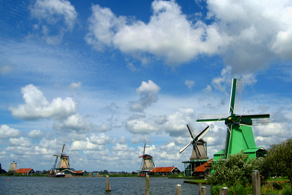

# Guetzli-test

Guetzli では雲にかかるブロックノイズが少ない。

## Windmill
|original|
|:---:|
|253,286bytes|
||
### libjpeg-turbo 1.5.1
|quality |size |butteraugli score|image |
|:----------:|:-----:|:------:|:-------------------:|
|80|29,154|2.59087|[■](images/wm/80.jpg)|
|81|30,245|2.52024|[■](images/wm/81.jpg)|
|82|31,089|2.40336|[■](images/wm/82.jpg)|
|83|32,435|2.3375|[■](images/wm/83.jpg)|
|84|33,414|2.27354|[■](images/wm/84.jpg)|
|85|34,426|2.21389|[■](images/wm/85.jpg)|
|86|36,132|2.01793|[■](images/wm/86.jpg)|
|87|37,251|1.98011|[■](images/wm/87.jpg)|
|88|39,286|1.96831|[■](images/wm/88.jpg)|
|89|40,842|1.91649|[■](images/wm/89.jpg)|
|90|43,443|1.88575|[■](images/wm/90.jpg)|
|91|45,649|1.82252|[■](images/wm/91.jpg)|
|92|48,002|1.75442|[■](images/wm/92.jpg)|
|93|52,212|1.65891|[■](images/wm/93.jpg)|
|94|57,496|1.54819|[■](images/wm/94.jpg)|
|95|63,751|1.61309|[■](images/wm/95.jpg)|
|96|71,362|1.43804|[■](images/wm/96.jpg)|
|97|81,099|1.43358|[■](images/wm/97.jpg)|
|98|94,898|1.45911|[■](images/wm/98.jpg)|
|99|118,821|1.41951|[■](images/wm/99.jpg)|
|100|134,685|1.41405|[■](images/wm/100.jpg)|
### Guetzli
|target |size |butteraugli score|image |
|:----------:|:-----:|:------:|:-------------------:|
|2.00|27,661|1.9997|[■](images/wm/b2.00.jpg)|
|1.90|29,575|1.89965|[■](images/wm/b1.90.jpg)|
|1.80|31,336|1.79945|[■](images/wm/b1.80.jpg)|
|1.70|33,036|1.6999|[■](images/wm/b1.70.jpg)|
|1.60|35,666|1.59999|[■](images/wm/b1.60.jpg)|
|1.50|38,483|1.49945|[■](images/wm/b1.50.jpg)|
|1.40|40,574|1.39968|[■](images/wm/b1.40.jpg)|
|1.30|43,501|1.29965|[■](images/wm/b1.30.jpg)|
|1.20|49,270|1.19976|[■](images/wm/b1.20.jpg)|
|1.10|53,652|1.09996|[■](images/wm/b1.10.jpg)|
|1.00|58,395|0.99981|[■](images/wm/b1.00.jpg)|
|0.90|65,439|0.89995|[■](images/wm/b0.90.jpg)|
|0.80|80,229|0.79996|[■](images/wm/b0.80.jpg)|
|0.70|92,106|0.69979|[■](images/wm/b0.70.jpg)|
|0.60|109,200|0.59986|[■](images/wm/b0.60.jpg)|
|0.50|132,030|0.49993|[■](images/wm/b0.50.jpg)|
|0.40|166,134|0.42525|[■](images/wm/b0.40.jpg)|
|0.30|200,242|0.4251|[■](images/wm/b0.30.jpg)|
|0.20|222,078|0.4251|[■](images/wm/b0.20.jpg)|
|0.10|226,050|0.4251|[■](images/wm/b0.10.jpg)|
|0.00|226,050|0.4251|[■](images/wm/b0.00.jpg)|

--------

libjpeg-turbo では髪のハイライトのオレンジの発色が良くないことに注目。Guetzli では元の色を再現できている。

## Siv3D-kun
|original|
|:---:|
|122,462bytes|
||
### libjpeg-turbo 1.5.1
|quality |size |butteraugli score|image |
|:----------:|:-----:|:------:|:-------------------:|
|80|51,898|3.23887|[■](images/s3/80.jpg)|
|81|53,280|3.11216|[■](images/s3/81.jpg)|
|82|54,616|3.03462|[■](images/s3/82.jpg)|
|83|56,308|2.9993|[■](images/s3/83.jpg)|
|84|57,710|2.98655|[■](images/s3/84.jpg)|
|85|59,227|2.98979|[■](images/s3/85.jpg)|
|86|61,515|2.96797|[■](images/s3/86.jpg)|
|87|63,266|2.84815|[■](images/s3/87.jpg)|
|88|65,991|2.68843|[■](images/s3/88.jpg)|
|89|68,151|2.61009|[■](images/s3/89.jpg)|
|90|71,927|2.54929|[■](images/s3/90.jpg)|
|91|74,792|2.4465|[■](images/s3/91.jpg)|
|92|78,017|2.37049|[■](images/s3/92.jpg)|
|93|83,410|2.31911|[■](images/s3/93.jpg)|
|94|90,127|2.33639|[■](images/s3/94.jpg)|
|95|97,533|2.3089|[■](images/s3/95.jpg)|
|96|107,099|2.02556|[■](images/s3/96.jpg)|
|97|117,834|2.03713|[■](images/s3/97.jpg)|
|98|130,838|2.03773|[■](images/s3/98.jpg)|
|99|153,807|2.00106|[■](images/s3/99.jpg)|
|100|171,806|1.99426|[■](images/s3/100.jpg)|
### Guetzli
|target |size |butteraugli score|image |
|:----------:|:-----:|:------:|:-------------------:|
|2.00|67,595|1.99972|[■](images/s3/b2.00.jpg)|
|1.90|69,939|1.89998|[■](images/s3/b1.90.jpg)|
|1.80|72,477|1.79714|[■](images/s3/b1.80.jpg)|
|1.70|75,753|1.69834|[■](images/s3/b1.70.jpg)|
|1.60|81,705|1.59871|[■](images/s3/b1.60.jpg)|
|1.50|98,332|1.49971|[■](images/s3/b1.50.jpg)|
|1.40|105,473|1.48244|[■](images/s3/b1.40.jpg)|
|1.30|110,444|1.48095|[■](images/s3/b1.30.jpg)|
|1.20|118,535|1.48288|[■](images/s3/b1.20.jpg)|
|1.10|133,051|1.48234|[■](images/s3/b1.10.jpg)|
|1.00|160,576|1.48274|[■](images/s3/b1.00.jpg)|
|0.90|166,696|1.4814|[■](images/s3/b0.90.jpg)|

## Night

libjpeg quality=100 (195KB) よりも Guetzli (target = 2.00) (40KB) のほうが、モスキートノイズは多いが夜景の色がオリジナルに近い。

|original|
|:---:|
|404,490bytes|
||

### libjpeg-turbo 1.5.1
|quality     |size  |butteraugli score|image      |
|:----------:|:-----:|:------:|:-------------------:|
|80|34,774|4.52051|[■](images/nc/80.jpg)|
|81|35,747|4.39459|[■](images/nc/81.jpg)|
|82|36,964|4.30205|[■](images/nc/82.jpg)|
|83|38,157|4.15123|[■](images/nc/83.jpg)|
|84|39,262|4.18583|[■](images/nc/84.jpg)|
|85|40,530|4.09054|[■](images/nc/85.jpg)|
|86|42,407|4.13364|[■](images/nc/86.jpg)|
|87|43,597|4.01935|[■](images/nc/87.jpg)|
|88|45,907|3.98345|[■](images/nc/88.jpg)|
|89|47,488|3.84399|[■](images/nc/89.jpg)|
|90|50,882|3.80082|[■](images/nc/90.jpg)|
|91|53,388|3.766|[■](images/nc/91.jpg)|
|92|55,943|3.75991|[■](images/nc/92.jpg)|
|93|61,734|3.71627|[■](images/nc/93.jpg)|
|94|68,260|3.55545|[■](images/nc/94.jpg)|
|95|77,431|3.50994|[■](images/nc/95.jpg)|
|96|86,877|3.47699|[■](images/nc/96.jpg)|
|97|100,439|3.40314|[■](images/nc/97.jpg)|
|98|116,024|3.37964|[■](images/nc/98.jpg)|
|99|159,754|3.34243|[■](images/nc/99.jpg)|
|100|199,369|3.33324|[■](images/nc/100.jpg)|
### Guetzli
|target     |size  |butteraugli score|image      |
|:----------:|:-----:|:------:|:-------------------:|
|2.00|40,641|1.99845|[■](images/nc/b2.00.jpg)|
|1.90|42,408|1.89973|[■](images/nc/b1.90.jpg)|
|1.80|44,486|1.79996|[■](images/nc/b1.80.jpg)|
|1.70|46,759|1.69838|[■](images/nc/b1.70.jpg)|
|1.60|49,145|1.59891|[■](images/nc/b1.60.jpg)|
|1.50|53,963|1.49956|[■](images/nc/b1.50.jpg)|
|1.40|57,782|1.39973|[■](images/nc/b1.40.jpg)|
|1.30|63,124|1.29951|[■](images/nc/b1.30.jpg)|
|1.20|72,943|1.19989|[■](images/nc/b1.20.jpg)|
|1.10|79,501|1.09986|[■](images/nc/b1.10.jpg)|
|1.00|89,083|0.99991|[■](images/nc/b1.00.jpg)|
|0.90|102,748|0.89998|[■](images/nc/b0.90.jpg)|
|0.80|130,234|0.79997|[■](images/nc/b0.80.jpg)|
|0.70|175,834|0.69995|[■](images/nc/b0.70.jpg)|
|0.60|228,884|0.6674|[■](images/nc/b0.60.jpg)|
|0.50|289,422|0.67483|[■](images/nc/b0.50.jpg)|
